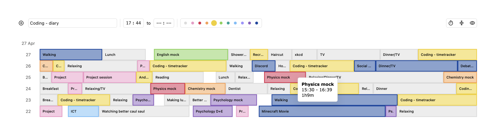
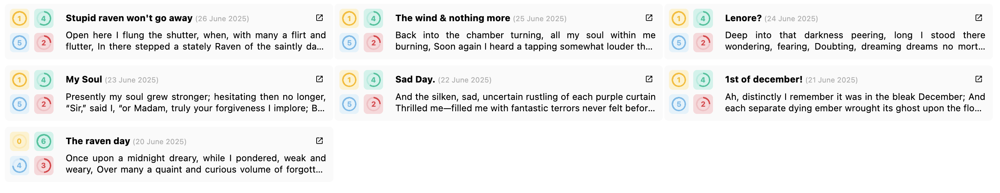
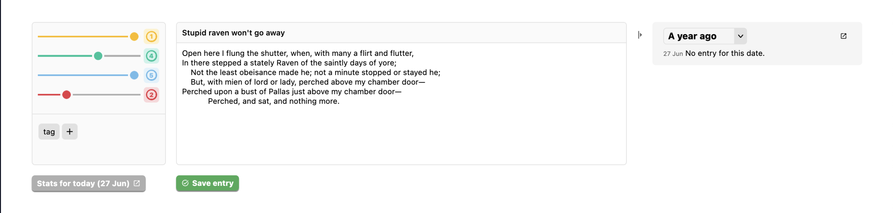

# productivity-suite
Simple productivity suite made with a JS/HTML/CSS frontend and a Python backend. Mostly for personal use, but feel free to try it out if you like; everything works locally and is saved to csv files on disk.

## Current apps
### Timetracker

Simple timetracker, with granular control over each entry. Add colors, visualise data and adjust formatting.
> Usage: add items to your day using the form at the top; double-click on items to edit them (leave the "name" field blank to delete); interact with the dates on the left for various functionality.

### Diary


Simple diary app. Add days with rich features such as tags and ratings; edit older entries; and view all entries in a cohesive dashboard.
> Usage: use "Add entry" button to create a new entry; use the edit icon on entries in the main dashboard to edit them.

## Usage

Clone the repository
```
git clone https://github.com/carbonioid/productivity-suite
```
Install the required packages (create a venv here if you like)
```
cd productivity-suite
pip install -r requirements.txt
```
Finally, start the application. Optionally, set a port here. The value will default to 8000 otherwise.
```
python3 src/app.py <port>
```

> Access at `127.0.0.1:<port>/timetracker` & `127.0.0.1:<port>/diary` 
